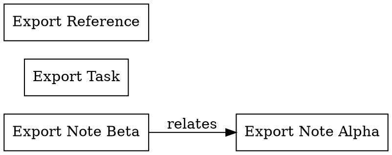

# Category 9: Export -- Critique

**Tests**: BAT-98 through BAT-102
**Date**: 2026-02-27
**CLI Version**: ztlctl 0.1.0

---

## Test Results Summary

| BAT | Test Name | Result | Exit Code | Notes |
|-----|-----------|--------|-----------|-------|
| 98 | Export Markdown | PASS | 0 | 4 files exported, directory structure preserved |
| 99 | Export Indexes | PASS | 0 | index.md + 3 type indexes, empty by-topic |
| 100 | Export Graph DOT | PASS | 0 | Valid DOT output, pipe-friendly design |
| 101 | Export Graph JSON | PASS | 0 | Valid JSON with nodes + links arrays |
| 102 | Export Graph -- Invalid Format | PASS | 2 | Click validation rejects 'xml', lists valid options |

**Overall Score: 5/5 PASS**

---

## Individual Test Evaluations

### BAT-98: Export Markdown (PASS)

Exported 4 content items to a new directory, preserving the original directory structure (`notes/`, `ops/tasks/`).

**Response structure**:
```json
{
  "ok": true,
  "op": "export_markdown",
  "data": {
    "output_dir": "/.../.bat/bat-98-export-md",
    "file_count": 4
  }
}
```

**Critique**: Clean, straightforward export. The directory structure preservation is important for vault portability -- exported markdown can be dropped into another vault or tool. The `file_count` field provides verification without needing to inspect the output directory. The command creates the output directory if it does not exist, which is convenient.

**Missing features that would add value**:
- `--include-type` / `--exclude-type` filters (export only notes, skip tasks)
- `--flatten` option to export all files to a single directory
- `--strip-frontmatter` option for clean markdown export to non-zettelkasten tools
- Progress indication for large vaults

**Usefulness**: HIGH. Markdown export is the primary data portability mechanism. Any note-taking system that cannot export its data is a trap.

### BAT-99: Export Indexes (PASS)

Generated index files:
- `index.md` -- master index of all 4 items
- `by-type/note.md` -- 2 notes
- `by-type/reference.md` -- 1 reference
- `by-type/task.md` -- 1 task
- `by-topic/` -- exists but empty (no topic subdirectories used)

**Response structure**:
```json
{
  "ok": true,
  "op": "export_indexes",
  "data": {
    "output_dir": "/.../.bat/bat-99-export-idx",
    "files_created": ["index.md", "by-type/note.md", "by-type/reference.md", "by-type/task.md"],
    "node_count": 4
  }
}
```

**Critique**: The index export generates navigable entry points into the vault. The by-type grouping is the most useful organization for browsing. The `files_created` list is helpful for verification. The by-topic directory being empty is correct behavior -- topic directories are filesystem-based, and test content was not placed in topic subdirectories.

**Missing features that would add value**:
- By-tag indexes (group by tag domain/scope)
- By-status indexes (draft, active, archived)
- By-date indexes (chronological or by-month)
- Link count or graph connectivity info in index entries
- Table of contents with anchor links in master index

**Usefulness**: MODERATE-HIGH. Index generation is valuable for static site generation, documentation snapshots, or creating navigable vault overviews. The by-topic gap limits value until topic directories are used.

### BAT-100: Export Graph DOT (PASS)

Produced valid Graphviz DOT output:


**Critique**: The DOT output is well-formed and includes meaningful metadata (node labels, types, edge labels). The `rankdir=LR` (left-to-right) layout is a good default for knowledge graphs. The graph correctly includes the auto-reweave edge between the two notes. The pipe-friendly design (raw content to stdout, bypassing `--json` wrapper) is the right architectural choice -- this output is meant for `dot -Tpng` or similar tools.

**Design observation**: The `--json` flag is intentionally ignored for stdout graph output. This is documented in the code (`# Pipe-friendly: raw content to stdout`). When `--output` is specified, a JSON summary is emitted instead. This dual behavior is pragmatic but could confuse users who expect `--json` to always produce JSON.

**Missing features that would add value**:
- Color coding by node type (notes=blue, tasks=orange, references=green)
- Cluster grouping by topic or tag domain
- Edge weight/thickness based on relationship strength
- `--filter-type` to export subgraphs
- Node shape differentiation by type (box for notes, diamond for tasks)

**Usefulness**: HIGH. Graph visualization is a core value proposition of a zettelkasten system. DOT format is the universal standard for graph tools. The output can be rendered with Graphviz, converted to SVG/PNG, or processed by graph analysis tools.

### BAT-101: Export Graph JSON (PASS)

Produced valid JSON graph interchange format:
```json
{
  "nodes": [
    {"id": "ztl_ea61e18b", "title": "Export Note Alpha", "type": "note"},
    {"id": "ztl_250b2d9c", "title": "Export Note Beta", "type": "note"},
    {"id": "TASK-0001", "title": "Export Task", "type": "task"},
    {"id": "ref_2c30e09b", "title": "Export Reference", "type": "reference"}
  ],
  "links": [
    {"source": "ztl_250b2d9c", "target": "ztl_ea61e18b", "edge_type": "relates"}
  ]
}
```

**Critique**: The JSON graph format follows the standard nodes+links pattern used by D3.js force-directed graphs and other visualization libraries. This makes it immediately usable with web-based graph visualization tools. The `edge_type` field preserves relationship semantics. The structure is clean and minimal.

**Missing fields that would add value**:
- Node metadata: status, tags, created date, degree (in/out)
- Edge metadata: weight, created date
- Graph-level metadata: node count, edge count, density, connected components
- Compatibility note or schema version

**Usefulness**: HIGH. JSON graph format enables integration with web visualization tools (D3.js, Cytoscape.js, vis.js), graph databases (Neo4j import), and custom analysis scripts. This is the primary machine-readable graph interchange format.

### BAT-102: Export Graph -- Invalid Format (PASS)

Click correctly rejected `xml` at the parameter validation level:
```
Error: Invalid value for '--format': 'xml' is not one of 'dot', 'json'.
```

Exit code 2 (Click usage error, not application error).

**Critique**: The validation is clean and happens at the CLI layer before any application logic runs. The error message clearly lists valid options. Exit code 2 is correct for CLI usage errors (distinct from exit 1 for application errors). The `--json` flag does not wrap Click validation errors in JSON format, which is expected since the command never reaches the application layer.

**Minor issue**: The error message is printed twice (Click outputs to both stdout and stderr). This is a Click framework behavior, not an application bug.

**Usefulness**: MODERATE. Input validation is table stakes. The test confirms Click's type system is properly configured.

---

## Overall Assessment

### Strengths
1. **Three complementary formats**: Markdown (portability), indexes (navigation), graph (visualization) cover all export needs
2. **Pipe-friendly graph output**: Raw DOT/JSON to stdout enables Unix pipeline workflows
3. **Directory structure preservation**: Markdown export maintains vault organization
4. **Machine-readable responses**: Consistent JSON structure with file counts and paths
5. **Clean validation**: Invalid inputs are caught at the CLI layer with helpful messages
6. **Auto-directory creation**: Output directories are created if they do not exist

### Weaknesses
1. **No filtering options**: Cannot export a subset (by type, tag, status, date range)
2. **Limited graph metadata**: DOT/JSON exports include minimal node/edge attributes
3. **No visual differentiation in DOT**: All nodes look the same (box shape, no colors)
4. **Empty by-topic in indexes**: Topic-based indexing depends on directory placement, which may not always be used
5. **JSON flag inconsistency**: `--json` is ignored for graph stdout output -- pragmatic but potentially confusing
6. **No incremental export**: Always exports everything, no "export only changes since last export"

### Missing Export Formats
- **CSV/TSV**: Spreadsheet-friendly tabular export of metadata
- **OPML**: Outline format for importing into other tools
- **HTML**: Static site generation from vault content
- **Obsidian**: Export with Obsidian-compatible wikilinks and metadata

### Usefulness Rating: 8/10

The export system covers the essential formats (markdown, indexes, graph) with clean implementations. The pipe-friendly graph design is particularly well-thought-out for CLI workflows. The main gaps are filtering (export subsets) and richer graph metadata. For a v0.1.0 release, the export functionality is solid and addresses the primary use cases: data portability (markdown), navigation (indexes), and visualization (graph).

---

## Pass Rate: 5/5 (100%)
- Full passes: 5
- Partial passes: 0
- Failures: 0
